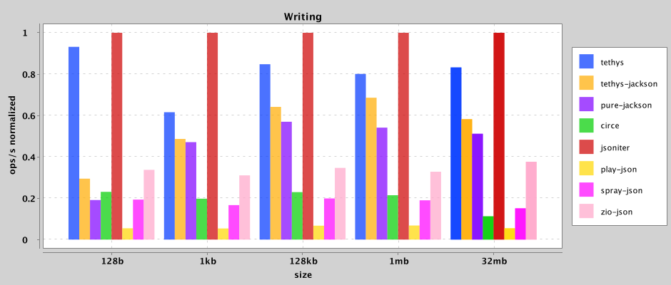

# Parsing

name \ size|128b|1kb|128kb|1mb|32mb
---|---|---|---|---|---
tethys-jackson|1442640.742|160561.914|1342.185|160.448|3.014
pure-jackson|1189799.594|212591.263|1721.623|184.572|3.733
circe-jawn|866471.554|112596.096|945.419|124.767|1.523
circe-jackson|348613.16|48776.933|363.005|39.485|0.872
play-json|534060.4|64804.735|499.574|43.91|0.927
spray-json|971689.213|121363.845|1028.76|123.771|2.188
zio-json|2001448.661|255068.591|2001.826|237.499|3.439

     
         

# Writing

name \ size|128b|1kb|128kb|1mb|32mb
---|---|---|---|---|---
tethys|5623657.356|549741.974|4728.468|582.912|16.223
tethys-jackson|1778419.803|434317.737|3577.799|499.213|11.343
pure-jackson|1153651.397|420722.96|3177.921|394.1|9.972
circe|1393264.287|176604.569|1279.973|156.184|2.192
jsoniter|6036735.563|892874.569|5576.712|727.844|19.491
play-json|329380.553|48283.895|375.691|49.423|1.065
spray-json|1167053.231|149003.266|1109.504|138.309|2.95
zio-json|2034331.785|277147.012|1934.274|238.862|7.332

     
         