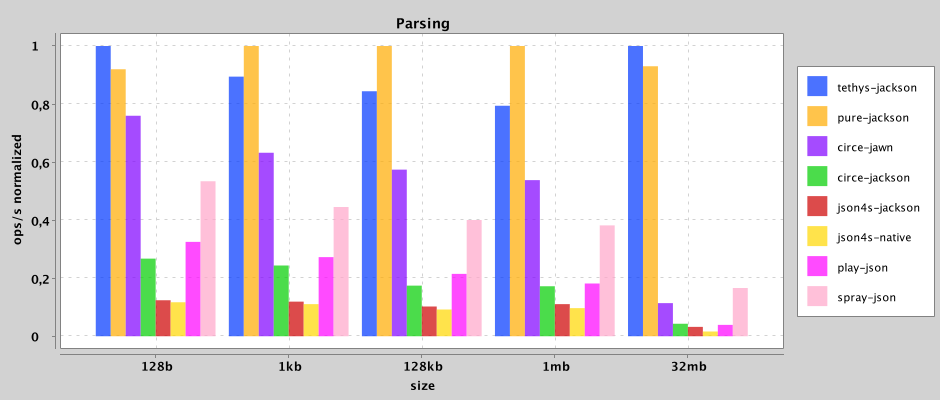

# Parsing

name \ size|10|100|1000|10000|100000
---|---|---|---|---|---
tethys-jackson|26151.191|3000.388|302.027|24.366|2.949
pure-jackson|31502.612|3105.643|331.109|29.249|3.61
circe-jawn|16899.409|1757.162|167.423|18.187|1.191
circe-jackson|4442.562|503.162|51.477|4.508|0.343
json4s-jackson|4783.177|584.713|59.856|4.736|0.375
json4s-native|4565.986|472.484|38.631|2.702|0.061
play-json|8097.424|802.017|90.829|6.715|0.5
spray-json|13909.521|1461.049|143.485|13.54|1.09
pushka|17011.93|1793.742|172.93|17.379|1.482

     
         

# Writing

name \ size|10|100|1000|10000|100000
---|---|---|---|---|---
tethys-jackson|80050.495|8080.388|781.19|59.795|5.256
pure-jackson|60366.95|7881.735|762.444|53.371|5.383
circe|26454.325|2624.433|219.181|18.68|1.76
java.lang.StringBuilder|59123.466|6965.116|613.214|47.91|4.807
scala.StringBuilder|56192.622|6411.235|601.54|51.841|4.768
json4s-jackson|6041.135|673.173|68.802|6.143|0.556
json4s-native|8167.998|878.273|85.061|9.145|0.828
play-json|5254.174|625.363|60.902|5.524|0.482
spray-json|18381.438|1745.193|142.44|14.07|1.234
pushka|17759.173|1921.791|162.733|15.325|1.345

     
         